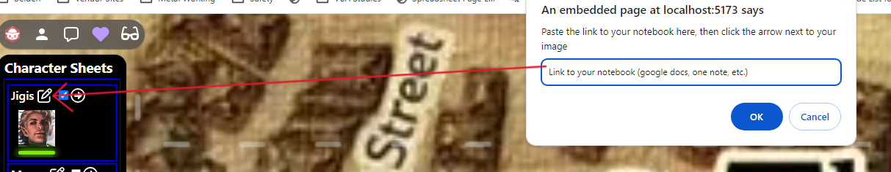

# obr-ext-healthbars

Extension for Owlbear Rodeo 2 to add a character interaction sheet.
To use this app extension, the character sheet on DnDBeyond **_MUST_** be set to **_public_**.

NOTICE: (22Mar2024) This is best done using the **_OBR Prefab extension_**, as it will store and restore saved data across scenes.

1. Select your characters and creat a new **_Prefab Scene_**.

2. Copy your character ID from the DnDBeyond character sheet.
   **_Your character requires an image for functionality. I am working on a fix_**

   

3. Click Add to character sheet and paste character ID from step 1.
   

4. Clicking on the extension icon will open the view, and the image from the characget sheet will be displayed with some icons.
   

5. The DM screen includes a checkbox to enable players to view and interact with the extension.
   

6. The healthbar directly under the character image will move dynamically when health is affected on DnDBeyond.
   ![5]

https://github.com/Leftysloft/obr-ext-healthbars/assets/5694639/919fa4b0-5441-4150-9fff-6b335cfe7f11

7. To add/edit you notebook url, click on the pen-n-square icon.
   

8. View the notebook by clicking the circle-rightArrow-icon.
   

9. Clicking on the character image will open a window to the DnDBeyond character page. The character owner and the DM can interact as normal.
   

10. You can drag the app around the map window.

https://github.com/Leftysloft/obr-ext-healthbars/assets/5694639/d9c20dda-cd11-48d7-916b-d77e278bbc47
